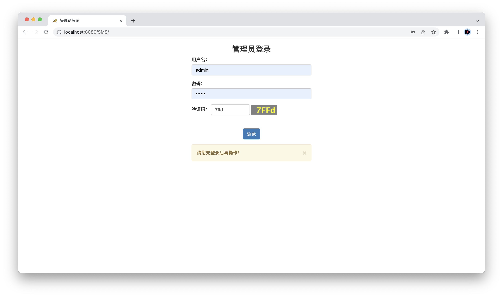
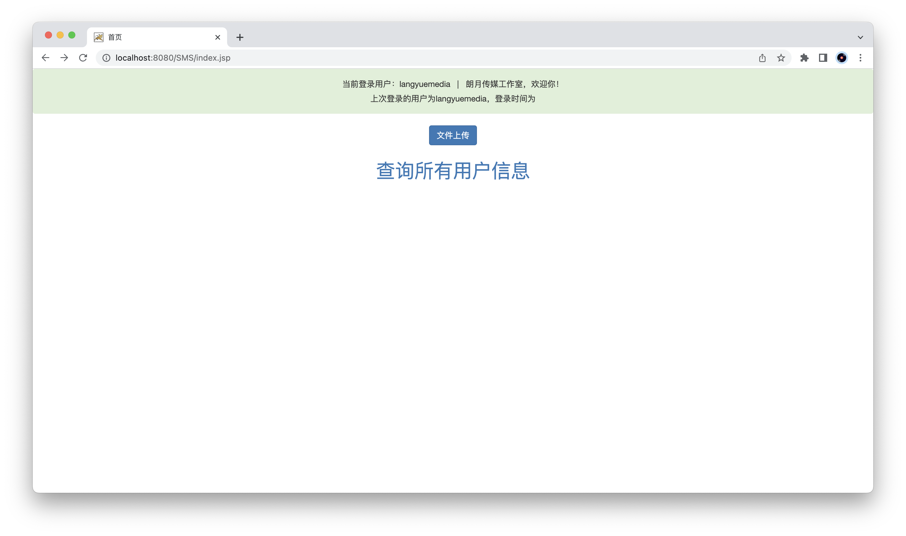
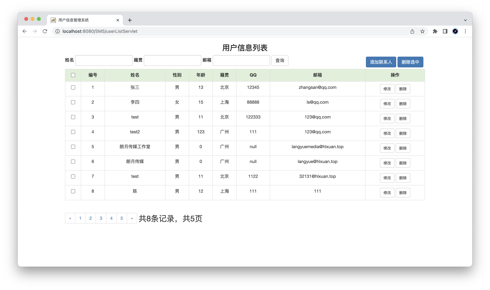
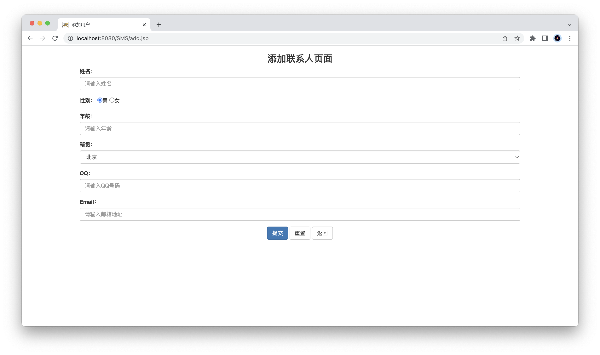
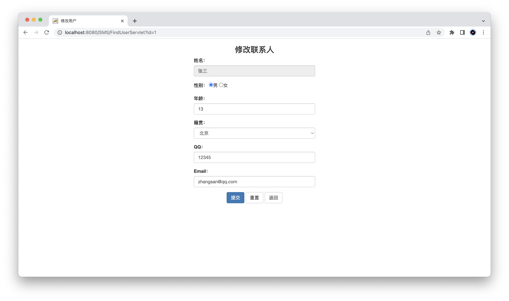
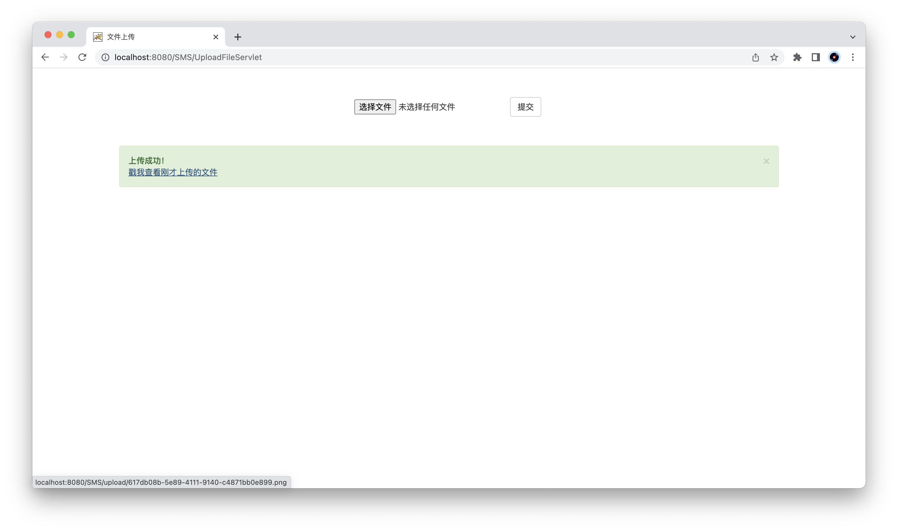

# 用户信息管理系统（简）

## 一、前言

该项目是我在学校学习“Java Web”课程所完成的期末项目“用户信息管理系统”。


## 二、项目介绍

### 项目技术栈

前端：HTML/CSS/JavaScript、BootStrap、JSP

后端：MySQL 8.0、JRE16.0.2、Tomcat V8.5


### 页面截图

#### 登录页面



#### 首页



#### 用户信息列表



#### 添加联系人页面



#### 修改联系人页面



#### 文件上传功能




## 三、运行方法

### （一）在MySQL里运行以下SQL语句

```sql
create database db_user;
use db_user;
SET FOREIGN_KEY_CHECKS=0;
DROP TABLE IF EXISTS `user`;
CREATE TABLE `user` (
  `id` int(11) NOT NULL AUTO_INCREMENT,
  `name` varchar(20) NOT NULL,
  `gender` varchar(5) DEFAULT NULL,
  `age` int(11) DEFAULT NULL,
  `address` varchar(32) DEFAULT NULL,
  `qq` varchar(20) DEFAULT NULL,
  `email` varchar(50) DEFAULT NULL,
  `username` varchar(20) DEFAULT NULL,
  `password` varchar(20) DEFAULT NULL,
  PRIMARY KEY (`id`)
) ENGINE=InnoDB AUTO_INCREMENT=3 DEFAULT CHARSET=utf8;
INSERT INTO `user` VALUES ('1', '张三', '男', '13', '广州', '12345', 'zhangsan@qq.com', 'admin1', '12345');
INSERT INTO `user` VALUES ('2', '李四', '女', '15', '深圳', '88888', 'ls@qq.com', 'admin2', '12345');
```


### （二）修改文件

修改路径`src/main/java/`的`druid.properties`文件的代码

```
username=数据库登录帐户名
pasword=数据库登陆密码
```


### （三）运行

在Eclipse软件配置tomcat后运行。
